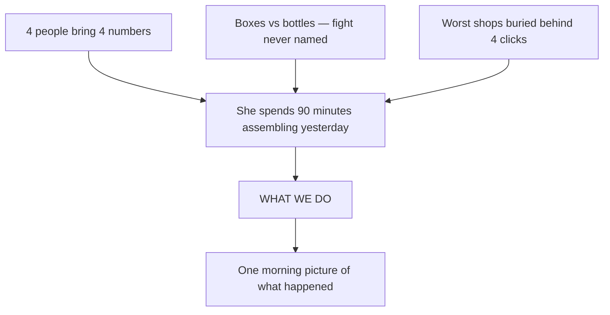
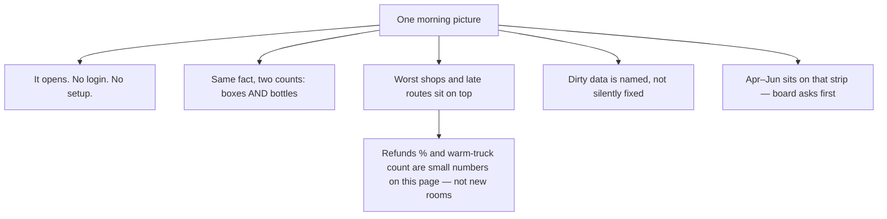
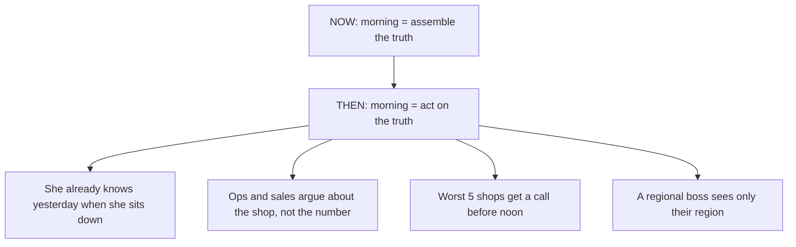
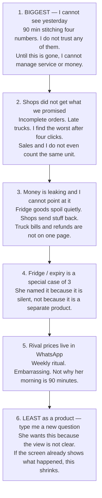
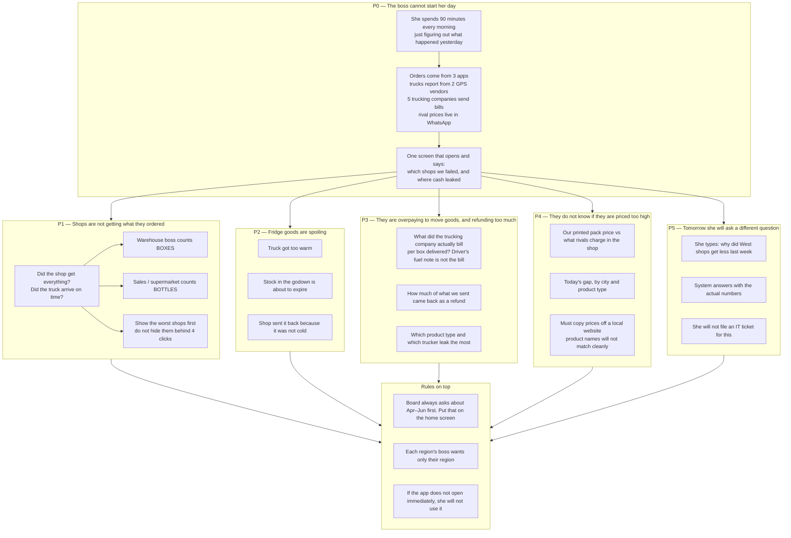
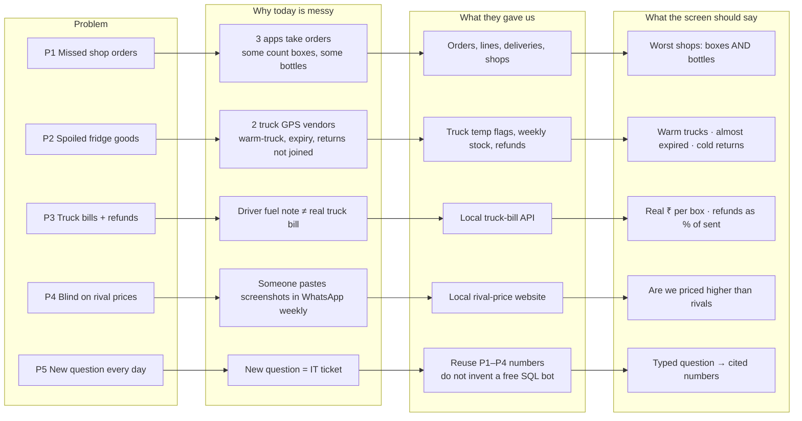

# Kestrel Control Tower — Situation & Client Brief

This note is a read-through of `01_Assignment_Brief.md` (same content as the `.docx`). It is not yet a build plan. Next step after you confirm this reading: decide what we actually ship in ~6 hours.

---

## In one sentence, no jargon

Kestrel is a grocery wholesaler. Every morning the ops boss cannot tell, from one place, **which shops did not get what they ordered**, **which fridge trucks went warm**, and **where cash is leaking**. She wants one screen for that, plus a box where she can type a question in English.

**Our product thesis (your words):** they need a **clear view of what is happening**. Not five modules. Not a finished platform. One picture they can trust, worst things first.

You locked: **rank 1 and 2 are the product.** Money and fridge are small numbers on that same picture, not a second app.

---

## What we are doing / how / impact

Not a build plan. Three tall pictures so each box stays readable.

### 1. What we are doing

Today they cannot see. We give them one trusted picture of yesterday.



### 2. How we solve it

Same page. Nothing extra to click through.



### 3. Impact — what changes if this works



### Same thing in three lines

| | |
|---|---|
| **What** | One picture of yesterday they can trust. |
| **How** | Opens immediately. Boxes and bottles side by side. Worst shops and late routes first. Say what we excluded. Apr–Jun on the strip. Refunds % and warm trucks as small numbers on that same picture. |
| **Impact** | The 90-minute reconstruction goes away. The four-number fight becomes one visible gap. She spends the morning on the five shops that failed, not on deciding which spreadsheet is wrong. |

### What we are not doing

Not a chatbot. Not a price-scrape product. Not a freight warehouse. Not eight tabs. Not cleaning their master data. Those treat smaller pains as the product and recreate the four-click hunt she already hates.


---

## Pain, from their chair — biggest to least

This is not “what the data pack lets us build.” It is what hurts *them* on a Tuesday morning. Rank is what we should spend hours on.



| Rank | What it feels like in her body | Why it is that rank | What “clear view” means |
|---|---|---|---|
| **1** | I sit down and I still do not know yesterday | She said this *before* any metric. Four people, four numbers. She decides which is wrong before she can decide anything else. | One screen. Opens. One story. Dirty data named, not silently fixed. Boxes **and** bottles so the fight is visible. |
| **2** | We are failing shops and I see it too late | Listed first under “specifically.” That is how they commit. Worst performers buried. Rakesh’s board/customer pain lives here. | Worst shops, routes, warehouses on the first screen. Q1 Apr–Jun on that same strip because the board asks it first. |
| **3** | Cash is leaving and I cannot point | Second half of “losing service and losing money.” Refunds, truck cost, spoilage. | Refunds as % of what we sent. If we show freight, billed ₹ not the driver’s fuel note. |
| **4** | Fridge goods die without a headline | “This is where our money quietly disappears.” A *cause* of 3, not a second app. | Warm trucks, almost-expired stock, cold returns as one pane *inside* the money/service view. |
| **5** | Are we priced like idiots | Weekly WhatsApp. Real, but not the 90-minute problem. | Skip unless 1–3 are poke-proof. Write it as next. |
| **6** | Tuesday’s question is not Monday’s | She asked for English questions *after* the screen that talks without being asked. | A question box is a crutch for a muddy view. Build it only if the view is already clear. |

**Rakesh is not a separate ranking.** He is rank 1 and 2 with a different unit. Hide bottles and you recreate her morning. **Regional bosses** are the same view with a region switch — not a sixth product. **Q1 on the front** is politics on rank 2, not its own pain.

### What this does to build hours

Spend almost everything on **rank 1 + 2**. That *is* “a clear view of what is happening.”

- Rank 3–4 only as numbers already on that same page (refunds %, warm-truck count). Not new apps.
- Rank 5–6 are what they can live without if time dies. The brief told us some sample questions are not worth building.

This is why we do not lead with a chatbot, a price scrape, or a freight warehouse. Those treat least-pains as the product.

---

## Simple words for the terms

Think of Kestrel as the middleman between factories and shops. They do not grow the food. They store it in 8 big warehouses and send trucks to ~700 shops across India.

| Term they used | Simple meaning | Kitchen analogy |
|---|---|---|
| Distributor | Buys goods, stores them, sells them to shops | The person who stocks many kiranas from one godown |
| Warehouse / DC | A big store-room that feeds many shops | The godown |
| Outlet | A shop that buys from Kestrel | Kirana, supermarket, restaurant, or online dark store |
| Channel | What kind of shop | Kirana vs supermarket vs restaurant vs Blinkit-style store |
| GT (general trade) | Small independent shops | Your local kirana |
| MT (modern trade) | Big organised retail | Reliance Fresh / DMart |
| HORECA | Hotels, restaurants, cafes | The hotel kitchen |
| E-com dark store | Warehouse that only packs online orders | Blinkit / Zepto store you never walk into |
| Ambient | Room-temperature goods | Rice, oil, biscuits |
| Chilled | Needs a fridge | Milk, curd, juice |
| Frozen | Needs a freezer | Ice cream |
| SKU | One specific product | "500ml mango juice, brand X" not "juice" |
| Case | A carton of many pieces | A box of 24 bottles |
| Each / eaches | One single piece | One bottle |
| Fill rate | Of what the shop ordered, what % actually arrived | Ordered 10, got 8 → 80% fill |
| OTIF | On Time **and** In Full | Arrived by the promised time **and** nothing missing |
| Cold chain | Keeping fridge/freezer goods cold the whole trip | The ice-cream must not melt from godown to shop |
| Temperature excursion | The fridge truck got too hot or too cold | Ice cream sat at 8°C instead of -18°C |
| Near-expiry | Stock that will go bad soon | Milk with 2 days left |
| Return | Shop sends product back | "This curd is sour, take it back" |
| Credit note | The refund slip for that return | Kestrel owes the shop money |
| Freight | What they pay to move goods | The truck bill |
| Carrier | The trucking company | The 5 logistics vendors |
| MRP | Printed max price on the pack | ₹45 on the juice carton |
| Competitor shelf price | What the rival is actually selling at | Same juice at ₹39 next door |
| Telematics | GPS + temperature sensors on the truck | The truck's black box |
| Control tower | One screen for the whole operation | Air-traffic control, but for trucks and stock |
| Dispatch | Goods that left the warehouse | "It has left the godown" |
| Q1 | First quarter of their financial year | April + May + June (India FY is Apr–Mar) |
| Regional manager | Boss of one of the 5 regions | West India head, not the national head |

### The one fight you must understand: cases vs eaches

Shop orders **2 boxes** of juice. Each box has 24 bottles.

- Warehouse ships **1 full box + 10 loose bottles**.
- **Case fill** (Divya / supply chain): "we shipped 1.4 of 2 boxes" — looks okay-ish to them.
- **Each fill** (Rakesh / sales / the supermarket): "we ordered 48 bottles, got 34" — the supermarket fines them on the **14 missing bottles**, not on "0.6 of a box".

That is why four people bring her four numbers. They are counting different things.

---

## Problem-statement map

One parent problem, five operational leaks, two political constraints.



### How to read the groups

| ID | Problem in plain words | Who cares | Done looks like |
|---|---|---|---|
| **P0** | She wastes 90 minutes assembling the truth | Divya, ops boss | One screen, opens, one story |
| **P1** | Shops did not get the full order, on time | Divya vs Rakesh | Worst shops/routes listed; **boxes and bottles both shown** |
| **P2** | Fridge/freezer goods spoiled | Ops / quality | Warm trucks, almost-expired stock, cold-related returns |
| **P3** | Truck bills and refunds are eating margin | Ops / finance | Real truck invoice ₹ per box; refunds as % of what was sent |
| **P4** | They are flying blind on rival prices | Sales | Today's price gap by city and product type |
| **P5** | She will not raise a ticket for every new question | Divya | Type English, get numbers |

The box-vs-bottle fight is not a sixth problem. It is **P1 splitting into two truths**. Hide one and you recreate her 90-minute morning.

---

## Same map, left-to-right: problem → cause → source → output



---


## What this assignment actually is

Forward Deployed Engineer take-home. Not a feature checklist. They will grade:

1. What you chose to build
2. What you chose not to build
3. Whether the thing you built holds up when poked

Time box: ~6 focused hours, 3 working days. AI tools are expected. Do not scrape anything except the shipped BazaarPulse site.

Hard requirements:

- A working system someone can open from a clean checkout (not a notebook/deck)
- `README.md` — cold start, one machine
- `DECISIONS.md` — one page max; they read this first
- Commit history as you go
- Do not commit the 820k-row SQLite file

---

## 1. The situation

**Client:** Kestrel Provisions Pvt Ltd — fictional Indian food/grocery distributor.

| Fact | Detail |
|---|---|
| What they do | Ambient + chilled + frozen from DCs to retail |
| Network | 8 DCs → ~700 outlets, 5 regions |
| Channels | GT, modern trade, HORECA, e-com dark stores |
| Scale | ~INR 900 crore annual revenue |
| Data window | 18 months, 1 Jan 2025 – 30 Jun 2026 |

**The operating mess (why they want a control tower):**

- Orders come from three systems: field sales app (`SFA_MOBILE`), ERP portal (`ERP_WEB`), partner API (`PARTNER_API`)
- Deliveries tracked by two telematics vendors (`TELEMATICS_A` / `TELEMATICS_B`) with different timestamp formats
- Freight billed by five carriers via a partner platform (actual cost is **not** in the DB; it is in the mock API)
- Competitor pricing is a weekly manual WhatsApp ritual

**The human problem:** Divya (Head of SCO) spends the first 90 minutes of every day reconciling four conflicting numbers before she can decide anything.

---

## 2. Two clients, one contradiction

### Divya Raghavan — Head of Supply Chain Operations

She wants **one screen** that, without being asked, shows:

| # | Theme | What she said | How to read it |
|---|---|---|---|
| 1 | Service | Fill rate + OTIF by region / warehouse / route / outlet. **Cases.** Worst performers first, no four-click hunt | Daily ops. Exception list, not a dashboard gallery |
| 2 | Cold chain | Temp excursions, near-expiry stock, returns from cold-chain failures | Quiet money leak. Cross-join deliveries + inventory + returns (`RT06`) |
| 3 | Money | Freight ₹/case delivered. Returns + credit notes as % of dispatch. Leakage by category and carrier | Freight must come from partner API, not `deliveries.fuel_cost_inr` |
| 4 | Price | Our MRP vs competitor shelf price. Today's gap by city and category | Requires scraping BazaarPulse; no SKU key on product titles |
| 5 | Ask-anything | "Why did fill rate drop in the West last week" → answer + numbers, not a chart | NLQ over the same metrics, not a chatbot demo |

Plus: regional managers need their own view. If it does not open, she will not use it.

### Rakesh Menon — National Sales Manager

Two additions that collide with Divya:

1. **Fill rate in eaches, not cases.** Modern trade penalises on units short. Half the SKU base ships mixed configs. This is why SCO and customer numbers never match.
2. **Q1 on the front page.** Board asks about Q1 first. FY is April–March, so "Q1" = Apr–Jun. Data ends 30 Jun 2026, so the latest complete Q1 is **FY26 Q1 (Apr–Jun 2026)**.

This contradiction is the assignment's first judgement call. They explicitly want it recorded in `DECISIONS.md`.

**Recommended stance (to confirm):** report **both** case fill (Divya / SCO commit) and each fill (Rakesh / customer invoice). Lead the board strip with FY Q1. Default the exception list to case fill, with a one-click each toggle. Never pick one and hide the other.

---

## 3. What "success" looks like in her language

Not a spec. Sense-check questions they will likely mutate:

1. Five worst case-fill outlets last month, exclude closed/test
2. OTIF by region, last complete quarter
3. Categories with largest return value + leading reason code
4. Temp excursions per 100 chilled deliveries, by month
5. Routes >2h late on more than 1 in 10 deliveries
6. Top 20 SKUs by value: our MRP vs lowest Mumbai competitor price
7. Freight ₹ per delivered case, by warehouse, last quarter
8. Outlets that ordered a discontinued SKU after discontinuation

These imply we must get **definitions** right: fill rate UOM, OTIF, closed/test filter, FY quarters, freight source, SKU match to BazaarPulse.

---

## 4. Assets vs the five asks

| Ask | Internal DB | Extra work |
|---|---|---|
| Service (fill / OTIF) | `orders`, `order_lines`, `deliveries`, `outlets`, `routes`, `warehouses` | UOM conversion (`qty_uom` not constant). Filter CLOSED / DELETED / test outlets |
| Cold chain | `deliveries.temperature_excursion_flag`, `inventory_snapshots` expiry, `returns` `RT01`/`RT06` | Dirty signs on return qty |
| Money | `returns_credit_notes`, dispatch value from orders/lines | **Partner API** for billed freight (paise, UTC, 429/503, cursor pagination). Ignore driver `fuel_cost_inr` |
| Price | `products.mrp_inr`, `product_price_history` | **Scrape BazaarPulse** — 4 cities, inconsistent pagination, no SKU key, respect robots.txt |
| Ask-anything | Same metrics | Thin NLQ over precomputed facts, not free-form SQL |

Optional enrichment (only if it explains variance): Open-Meteo weather, Nager.Date holidays.

---

## 5. Traps they planted on purpose

- Data dictionary is incomplete and partly wrong. Data wins.
- Header `order_value_*` may not reconcile to lines (one source system).
- `created_at` / `planned_arrival` / `actual_arrival` are messy text, vendor-dependent.
- Outlet duplicates, free-text city spellings, test/migration outlets still in prod.
- Return quantities: mixed sign convention.
- Freight API: first page slow, 429 ~1/9, 503 ~1/25, amounts in **paise**, timestamps UTC vs DB Asia/Kolkata.
- BazaarPulse: city markup differs, some pages unreachable, titles do not map to Kestrel SKUs.
- You are not expected to clean the data. You are expected to **notice** and surface it.

---

## 6. Working interpretation of the product

A **morning control tower**, not a BI suite.

1. Opens immediately. Regional filter for Divya + RMs.
2. Board strip: FY Q1 service + money, both fill definitions visible.
3. Exception lists first: worst outlets/routes, cold-chain leaks, freight/return leakage.
4. Price gap only if SKU matching can be honest (or we say we skipped it).
5. A question box that answers the five metric families with citations, not a generic LLM chat.
6. `DECISIONS.md` that names the cases-vs-eaches call, the Q1 definition, what we cut, and what breaks first at 100x volume.

What we should *not* do in 6 hours: a 12-page dashboard, a full freight warehouse, a perfect competitor matcher, or a chatbot that writes SQL.

---

## 7. What they do **not** want us to build

Filter every idea through this list. The brief is louder about anti-goals than about features.

### They said it in the pack

| They said | So we do not build |
|---|---|
| “Not a test of whether you can finish. Deliberately scoped larger than the time.” | All five of Divya’s bullets, all eight sample questions, a complete data platform |
| “A small, honest, working system beats a large half-working one.” | A pretty shell with broken fill / freight / scrape |
| “Not a notebook, not a slide deck, not a design.” | Jupyter analysis, Notion writeup, Figma, a README that *describes* a product |
| “Nothing else. No video, no deck.” | Walkthrough recordings, pitch slides |
| “Do not scrape any site other than the one shipped.” | Live BigBasket / Blinkit / anything on the public internet |
| “Do not use a client’s real data.” | Any real distributor extract |
| “Do not commit the database file.” | `kestrel_ops.db` in git |
| “You are not expected to fix the data. You are expected to notice.” | A week of master-data cleanup, “cleaned.csv” as the product |
| The 8 questions are “illustrative, not a specification. Some may not be worth building.” | A FAQ page that answers all 8 as if they were tickets |
| Weather / holidays: “‘it was available’ is not an answer.” | Open-Meteo / Nager.Date bolted on with no finding |
| Freight API: “Decide whether you need all of it.” | A 40k-invoice warehouse and a 20-minute cold start |
| Divya: “worst performers immediately, not after four clicks.” | Multi-tab BI, drill-down theme park |
| Divya: “an answer with the numbers… not a chart I have to interpret.” | Ask-anything that returns only a Plotly blob |
| Divya: “If it does not open, I will not use it.” | Auth, SSO, .env rituals, Docker-compose of 6 services |
| Rakesh vs Divya on cases vs eaches | Picking one definition and hiding the other |

### They will also punish these even though they did not name them

- LLM that writes SQL (they will poke it; it will lie)
- Perfect rival-SKU matcher (no key exists — overclaim)
- Login / roles / mobile / maps (time sinks that do not open faster)
- Silent filters that “fix” test outlets and never tell her

### What this does to the idea list

Keep only things that (1) **open**, (2) **tell her where service or money is leaking**, (3) **we can defend when poked**, (4) **we can name as cut in `DECISIONS.md`**.

Cut from the earlier menu:

- **F (rival prices)** is optional, not required. No SKU key. Easy to ship a lie. Default: skip, write “next two weeks.”
- **E (full invoice API)** is optional. Pulling every page is what they warned against. If we touch freight at all: one cached sample or last quarter, not a warehouse.
- **H (WhatsApp brief)** is garnish. Only if the spine is done.
- **Weather / holidays:** do not build.
- **Auth, maps, 8 tabs, SQL chatbot, data-cleaning pipeline:** do not build.

---

## 8. Build ideas — after that filter

Constraint: ~6 focused hours. **One local web app, one command, one morning screen.**

### Idea A — Morning exception board (core, ship this)

One page Divya opens at 8am.

- Top strip: Apr–Jun (their Q1) — % of orders fully delivered, % on time, refunds as % of what we sent. Show **boxes and bottles** next to each other so the two bosses stop arguing.
- Region switcher (West / North / …) for the regional managers.
- Three “worst first” lists: shops that got the least of what they ordered, late truck routes, refund-heavy product types.
- Click a shop → last 30 days of ordered vs received.

Why this wins: it is literally her brief. Defensible in interview. Fits the time box.

### Idea B — Two-truth fill meter (do this inside A, do not skip)

A small widget that says: “Supply chain says 94% (boxes). The supermarket will say 87% (bottles).”

- Same order, both counts.
- One line of English: “this is why your WhatsApp numbers never match.”

Why this wins: the brief planted this fight on purpose. Showing both is the FDE judgement they want in `DECISIONS.md`.

### Idea C — “Why did this drop?” question box (high value, keep it dumb)

A text box on the same page. Not ChatGPT over SQL.

- Parse a handful of patterns: fill / on-time / refunds / warm trucks / price, plus region + time window.
- Hit pre-computed numbers. Return 3–5 sentences with the actual figures and the table they came from.
- If it cannot answer: say so. Do not hallucinate.

Example: “why did fill rate drop in the West last week” → West bottle-fill 91% → 86%, top 3 short shops, top short-reason.

Why this wins: she asked for this by name. A constrained version is honest; a free SQL bot will lie in the interview.

### Idea D — Fridge-leak pane (medium, good if A is solid)

One column: trucks that went warm, stock about to expire, goods sent back because they were not cold.

- Warm trucks per 100 fridge deliveries, by month.
- Batches with few days left, by warehouse.
- Refunds tagged “cold chain” vs “near expiry.”

Why this wins: she called it the quiet money leak. Data is already in the SQLite file. No extra API.

### Idea E — Real truck bill vs driver’s fuel note (medium-hard, impressive if finished)

Pull invoices from the local truck-bill API (retries, pagination, paise → rupees, UTC → India time).

- ₹ billed per box delivered, by warehouse and by trucking company.
- Tiny comparison: driver-entered fuel vs actual invoice. Show they disagree. That is the point.

Why this wins: they hid the real cost on purpose. Handling 429/503 and not trusting `fuel_cost_inr` is an FDE signal. Risk: API walk can eat an hour. Cache to disk after one successful pull.

### Idea F — Rival price gap (stretch, only after A–C work)

Scrape the local BazaarPulse site. Match product names to Kestrel SKUs as best-effort.

- Today’s “we are ₹X more expensive” by city and product type.
- Honest match quality: “high / guess / unmatched.” Never pretend a fuzzy match is a key.

Why this is stretch: no shared product ID, four cities, messy HTML. Easy to look sloppy. Better to skip and write “we would do this next” than ship a wrong price board.

### Idea G — Data-trust strip (cheap, unique, they asked for this)

A yellow bar: “we noticed these lies in your data.”

- Test/closed shops still receiving orders.
- Order header ₹ ≠ sum of lines (one of the three apps).
- City names spelled three ways.
- Return quantities sometimes negative.

Why this wins: the brief says *do not fix the data, notice it*. Most candidates will silently filter. Surfacing it is the adult move.

### Idea H — Printed morning brief (cheap extra)

A “copy / print today’s brief” button: 8 lines of English generated from the same numbers. Regional managers can paste it into WhatsApp. No new metrics.

---

### Suggested 6-hour combo (pain-ranked + anti-goal compliant)

**Ship the clear-view spine: A + B + G.** That is rank 1 + 2.

On that same page, not as new products: Q1 strip, region switch, refunds % (rank 3, one number), warm-truck count (rank 4, one number).

**Default skip (least pain):** question box, price scrape, full freight walk, weather, holidays.

If rank 1–2 is poke-proof and an hour remains: add the fridge *rows* (D, still on the same page). Not a chatbot. Not a second site.

```text
Hour 1     Honest metrics (boxes + bottles, on-time, exclude closed/test — and *say* we excluded them)
Hour 2–3   Screen A + dual-truth B + trust strip G
Hour 4     One extra: C or D
Hour 5     Poke it. Break our own numbers. Fix definitions.
Hour 6     README + one-page DECISIONS.md (what we cut, cases vs eaches, Q1 = Apr–Jun) + commits
```

### Stack suggestion (boring on purpose)

Python (FastAPI) + SQLite + one HTML page. One command. Pre-compute daily facts. Do not query 500k lines on every refresh. No Docker ballet.

---

## Decision needed

The spine is no longer a menu item. It is A + B + G.

Which **one extra** — if any — do you want after that?

